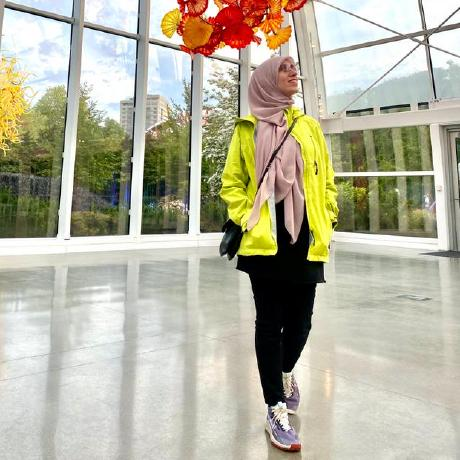

{width=250px}

Hello! I'm Teeba Obaid. I am a Master of Data Science student at the University of British Columbia. Before MDS, I completed a PhD in Educational Psychology and developed experience in research, instructional design, and data analysis through my academic work. I am especially interested in machine learning and hope to continue building my skills for data science and machine learning roles.