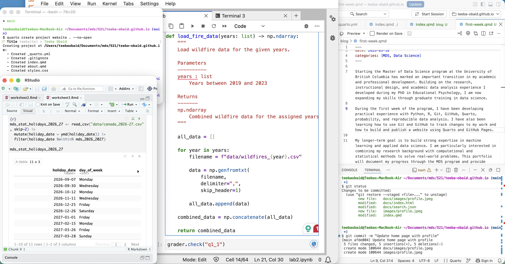

Starting the Master of Data Science program at the University of British Columbia has marked an important transition in my academic and professional development. Building on the research, instructional design, and academic data analysis experience I developed during my PhD in Educational Psychology, I am now expanding my skills through graduate training in data science.

During the first week of the program, I have been developing practical experience with Python, R, Git, GitHub, Quarto, probability, and reproducible data analysis. I have also been learning how to use Git and GitHub to track changes to my work and how to build and publish a website using Quarto and GitHub Pages.

My longer-term goal is to build strong expertise in machine learning and applied data science. I am particularly interested in combining my research background with computational and statistical methods to solve real-world problems. This portfolio will document my progress through the MDS program and provide examples of the technical and analytical skills I continue to develop.